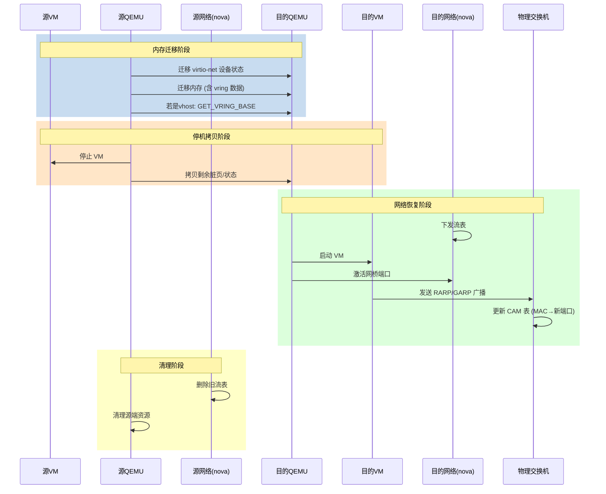

#### **整体迁移流程：**
![[resources/Diagram 3.svg]]

迁移主要流程：
qemuMigrationSrcPerformPeer2Peer3
qemuMigrationSrcBeginPhase 解析传入的虚拟机的xml信息
dconn-\>driver-\>domainMigratePrepare3 远程调用qemuMigrationDstPrepareDirect创建目的端的domain
qemuMigrationSrcPerformNative 开始数据迁移动作

finally：
dconn-\>driver-\>domainMigrateFinish3 远程调用qemuDomainMigrateFinish3等待目的端完成或失败
qemuMigrationSrcConfirmPhase 清理源端or清理目的端

incoming表示开始接收对端数据，下面是qemu启动的一些打印，然后传输数据，结束后状态改变，libvirt检测到也修改状态位，结束热迁移

#### **热迁移时序图：**
https://richardweiyang-2.gitbook.io/understanding_qemu/00-lm/04-ram_migration

**其中跟网络相关的热迁移时序图：**

#### **内存拷贝流程：**
**阶段一：数据迁移**
1、以~1s为周期进行脏页同步，期间判断若脏页速率高于迁移带宽20次，则迁移失败；
2、期间持续以最大限速带宽拷贝内存数据至目的端；
3、当满足条件“M < threshold_size” 时，进入快速迭代阶段；(M：剩余脏页量；threshold_size = bandwidth(+sync) * downtime_limit)
**阶段二：快速迭代拷贝**
1、以~50ms为周期进行脏页同步，未开启降频时继续进行高脏页计数判断；
2、期间持续以最大限速带宽拷贝内存数据至目的端；
3、cpu降频：脏页速率高于传输带宽时：每计数满2/4次降频一档；
4、强制收敛："M < threshold_size" 计数达到<force_converge>后，激活强制收敛，停机条件变更为"M < bandwidth(+sync) * force_downtime"；
5、动态调整min_downtime："M < threshold_size" 计数满20次调节一档（递增100ms）；
6、当满足条件“M < bandwidth(+sync) * min_downtime(40+ms)”时，进入停机拷贝阶段；
**阶段三：停机拷贝**
1、源端虚拟机停机；
2、以最大可用带宽拷贝完剩余脏页数据；
3、目的端虚拟机加载设备状态并启动，迁移完成；

#### **热迁移动作几个点：**
1. 大页虚拟机在迁移前会按照4K页粒度进行打散（会比较耗时）
2. 热迁移耗时包括（FS调度下发，内存迭代拷贝，数通下发流表拉起网络，目的端拉起时重建页表）
3. getdirty接口查询脏页时需要陷出标脏，对虚拟机有性能影响
4. uvpconf设置的set_migration_pin是对主机所有vm生效，domain.mingrationPin接口只是对单vm生效
5. 迁移时compare比较的是目的主机virsh capabilities和virsh dumpxml虚拟机的cpu feature
6. 迁移结束后目的端会进行rarp广播（异步动作）