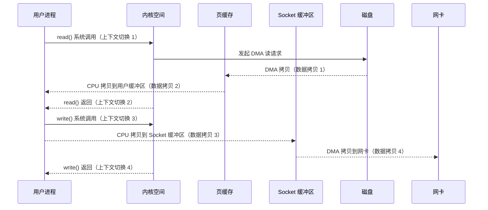
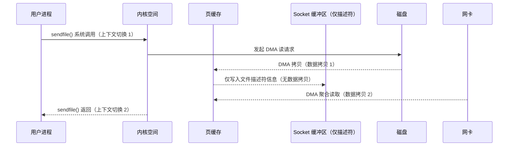
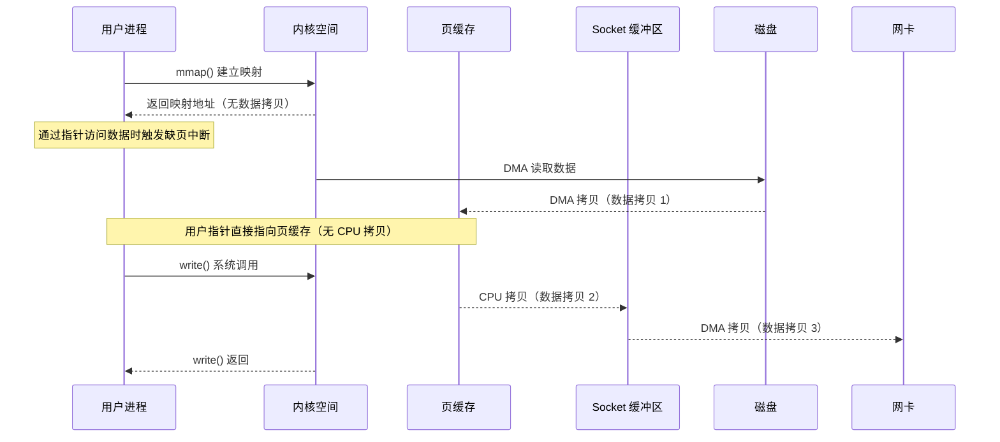
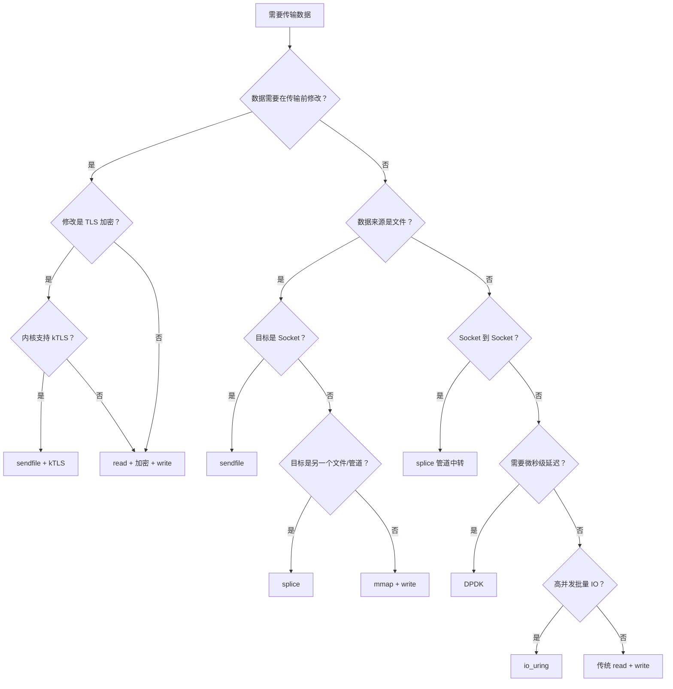

一个静态文件服务器要把磁盘上一个 1 GB 的视频文件发送给客户端，最朴素的写法是：

```c
char buf[8192];
int fd = open("video.mp4", O_RDONLY);
while ((n = read(fd, buf, sizeof(buf))) > 0) {
    write(sockfd, buf, n);
}
```

这段代码能跑，但性能很差。每一轮 `read` + `write` 循环，数据在内核和用户空间之间来回搬运了两次，CPU 做了两次完全没有意义的内存拷贝，操作系统做了四次上下文切换。当并发连接数上去之后，CPU 大部分时间花在搬数据上，而不是做真正有价值的计算。

这就是零拷贝（Zero-Copy）技术要解决的问题： **让数据在内核缓冲区之间直接流转，跳过用户空间的中转** 。

但零拷贝不是一个单一技术，而是一组机制： `sendfile()` 、 `splice()` 、 `mmap()` 、 `io_uring` 、DMA 聚合拷贝（DMA Gather Copy）、DPDK 用户态网络栈——它们各自解决不同层次的问题，各自有不同的使用条件和限制。搞清楚每种机制的适用场景和工程约束，比单纯知道”零拷贝快”重要得多。

在 [上一篇](https://quant67.com/post/architecture/34-threading-models/threading-models.html) 中我们讨论了线程模型对系统吞吐的影响，本文聚焦数据路径层面的优化——当线程模型已经足够高效，瓶颈落在 CPU 搬运数据上时，零拷贝就是下一个突破口。

> **适用范围说明** 本文讨论的系统调用行为基于 Linux 内核 5.x / 6.x。 `sendfile()` 的 DMA 聚合拷贝特性要求内核 2.4+， `splice()` 要求内核 2.6.17+， `io_uring` 要求内核 5.1+。DPDK 部分基于 DPDK 22.11 LTS。

---

## 一、传统数据路径：4 次拷贝与 4 次上下文切换

要理解零拷贝为什么快，先要搞清楚传统路径为什么慢。

当应用程序调用 `read(fd, buf, len)` 从磁盘读取数据，再调用 `write(sockfd, buf, len)` 写入网络套接字，Linux 内核内部经历以下步骤：

1. **用户态 → 内核态** （第 1 次上下文切换）：应用调用 `read()` ，陷入内核。
2. **DMA 拷贝** （第 1 次数据拷贝）：磁盘控制器通过 DMA 把数据从磁盘搬到内核的页缓存（Page Cache）。
3. **内核缓冲区 → 用户缓冲区** （第 2 次数据拷贝）：内核把页缓存中的数据拷贝到应用程序的用户空间缓冲区 `buf` 。
4. **内核态 → 用户态** （第 2 次上下文切换）： `read()` 返回，回到用户态。
5. **用户态 → 内核态** （第 3 次上下文切换）：应用调用 `write()` ，再次陷入内核。
6. **用户缓冲区 → Socket 缓冲区** （第 3 次数据拷贝）：内核把用户空间缓冲区的数据拷贝到 Socket 发送缓冲区。
7. **Socket 缓冲区 → 网卡** （第 4 次数据拷贝）：网卡通过 DMA 把 Socket 缓冲区的数据搬到网络接口。
8. **内核态 → 用户态** （第 4 次上下文切换）： `write()` 返回。

整个过程： **4 次数据拷贝（2 次 DMA + 2 次 CPU）、4 次上下文切换** 。

其中第 2 次和第 3 次拷贝完全是浪费——数据从内核拷贝到用户空间，应用程序看都没看一眼，又原封不动地拷贝回内核。这两次 CPU 拷贝消耗的不仅是 CPU 周期，还有 L1/L2/L3 缓存的污染——大块数据流过 CPU 缓存会把热点数据挤出去，导致其他计算密集型任务的缓存命中率下降。

下面的 Mermaid 图展示了传统路径的完整数据流：



### 性能影响的量化

在一台典型的服务器上（Intel Xeon、DDR4 内存、10 Gbps 网卡）， `memcpy()` 的吞吐约为 10-15 GB/s。传输 1 GB 文件需要额外 2 次 CPU 拷贝（合计 2 GB 的 `memcpy` ），耗时约 130-200 毫秒。这看起来不多，但在万级并发下，这些 CPU 拷贝会成为瓶颈。

更关键的是上下文切换的开销。每次用户态/内核态切换大约消耗 1-5 微秒（取决于是否需要刷新 TLB），4 次切换本身的延迟在 4-20 微秒。在高频小包场景下（比如每个请求只传 4 KB），上下文切换的开销可能比数据拷贝还大。

---

## 二、sendfile()：最经典的零拷贝

`sendfile()` 是 Linux 2.1 引入的系统调用（2.4 开始支持 DMA 聚合拷贝优化），专门为”从文件描述符发送数据到 Socket”这个场景设计。

### 基本语义

```c
#include <sys/sendfile.h>

// 从 in_fd 的 offset 位置读取 count 字节，写入 out_fd
ssize_t sendfile(int out_fd, int in_fd, off_t *offset, size_t count);
```

`sendfile()` 做了一件关键的事： **数据不再经过用户空间** 。内核直接把页缓存中的数据拷贝到 Socket 缓冲区（或者通过 DMA 聚合拷贝直接发给网卡），上下文切换从 4 次减少到 2 次。

### 数据路径（带 DMA 聚合拷贝）

当网卡支持 scatter-gather DMA（现代网卡基本都支持）， `sendfile()` 的数据路径进一步优化：

1. **用户态 → 内核态** （第 1 次上下文切换）：应用调用 `sendfile()` 。
2. **DMA 拷贝** （第 1 次数据拷贝）：磁盘 DMA 把数据搬到页缓存（如果数据已在页缓存中，跳过此步）。
3. **记录描述符** ：内核不拷贝数据本身，而是把页缓存中数据的内存地址和长度记录到 Socket 缓冲区的描述符中。
4. **DMA 聚合拷贝** （第 2 次数据拷贝）：网卡根据描述符，通过 DMA 直接从页缓存读取数据发送到网络。
5. **内核态 → 用户态** （第 2 次上下文切换）： `sendfile()` 返回。

结果： **2 次数据拷贝（都是 DMA，CPU 零拷贝）、2 次上下文切换** 。



### C 语言示例：文件传输

```c
#include <stdio.h>
#include <fcntl.h>
#include <sys/sendfile.h>
#include <sys/stat.h>
#include <sys/socket.h>
#include <unistd.h>

int send_file_to_client(int sockfd, const char *filepath) {
    int fd = open(filepath, O_RDONLY);
    if (fd < 0) {
        perror("open");
        return -1;
    }

    struct stat st;
    if (fstat(fd, &st) < 0) {
        perror("fstat");
        close(fd);
        return -1;
    }

    off_t offset = 0;
    ssize_t total = st.st_size;

    /* sendfile 可能不会一次发完，需要循环 */
    while (offset < total) {
        ssize_t sent = sendfile(sockfd, fd, &offset, total - offset);
        if (sent < 0) {
            perror("sendfile");
            close(fd);
            return -1;
        }
    }

    close(fd);
    return 0;
}
```

### Go 语言中的零拷贝

Go 标准库的 `net` 包在底层会自动使用 `sendfile()` ，但开发者需要使用正确的 API 才能触发：

```go
package main

import (
    "io"
    "net"
    "os"
    "log"
)

func handleConn(conn net.Conn) {
    defer conn.Close()

    f, err := os.Open("video.mp4")
    if err != nil {
        log.Printf("open: %v", err)
        return
    }
    defer f.Close()

    // io.Copy 检测到 src 是 *os.File、dst 是 *net.TCPConn 时
    // 会自动调用 sendfile() 系统调用
    _, err = io.Copy(conn, f)
    if err != nil {
        log.Printf("copy: %v", err)
    }
}

func main() {
    ln, err := net.Listen("tcp", ":8080")
    if err != nil {
        log.Fatal(err)
    }
    for {
        conn, err := ln.Accept()
        if err != nil {
            log.Printf("accept: %v", err)
            continue
        }
        go handleConn(conn)
    }
}
```

关键点：必须使用 `io.Copy()` （或 `io.WriteTo()` ）而不是手动 `Read` + `Write` 。Go 运行时通过 `ReadFrom` 接口检测到 `*os.File` → `*net.TCPConn` 的组合时，会走 `sendfile()` 路径。如果你先把文件内容读到 `[]byte` 里再写入连接，零拷贝就失效了。

### sendfile() 的限制

| 限制 | 说明 |
| --- | --- |
| 输入必须是文件 | `in_fd` 必须支持 `mmap()` （通常是普通文件），不能是 Socket 或管道 |
| 输出必须是 Socket | 在 Linux 2.6.33 之前， `out_fd` 必须是 Socket；2.6.33 之后可以是任意文件描述符 |
| 不能修改数据 | 数据从文件到网卡全程不经过用户空间，无法在中途做加密、压缩等变换 |
| 不支持 HTTPS | SSL/TLS 需要在用户空间加密数据， `sendfile()` 无法使用（除非用 kTLS） |
| 大文件问题 | 32 位系统上 `off_t` 是 32 位，单次最多发送 2 GB；需要用 `sendfile64()` |

### kTLS：让 sendfile() 支持 TLS

Linux 4.13 引入了内核 TLS（kTLS），把 TLS 记录层的加密下沉到内核。配合 `sendfile()` ，数据可以在内核中加密后直接通过 DMA 发送到网卡，不需要回到用户空间。Nginx 1.21.4+ 和 HAProxy 2.5+ 都已支持 kTLS。

配置 kTLS 需要： 1. 内核版本 4.13+，编译时启用 `CONFIG_TLS` 2. 用户态 TLS 库完成握手后，通过 `setsockopt(SO_TLS)` 把 TLS 会话参数传递给内核 3. 后续数据发送使用 `sendfile()` 即可自动加密

---

## 三、splice()：管道驱动的零拷贝

`splice()` 是 Linux 2.6.17 引入的系统调用，比 `sendfile()` 更通用。它的核心思想是： **通过内核管道（Pipe）在两个文件描述符之间移动数据，不经过用户空间** 。

### 基本语义

```c
#include <fcntl.h>

ssize_t splice(int fd_in, loff_t *off_in,
               int fd_out, loff_t *off_out,
               size_t len, unsigned int flags);
```

`splice()` 要求 `fd_in` 或 `fd_out` 中至少有一个是管道。这意味着如果要从文件传输到 Socket，需要两次 `splice()` 调用，中间用管道连接：

```c
#include <fcntl.h>
#include <unistd.h>
#include <stdio.h>

int splice_file_to_socket(int filefd, int sockfd, size_t len) {
    int pipefd[2];
    if (pipe(pipefd) < 0) {
        perror("pipe");
        return -1;
    }

    ssize_t total = 0;
    while (total < (ssize_t)len) {
        /* 第一步：文件 → 管道（零拷贝，只移动页引用） */
        ssize_t n = splice(filefd, NULL, pipefd[1], NULL,
                           len - total,
                           SPLICE_F_MOVE | SPLICE_F_MORE);
        if (n <= 0) break;

        /* 第二步：管道 → Socket（零拷贝） */
        ssize_t m = splice(pipefd[0], NULL, sockfd, NULL,
                           n,
                           SPLICE_F_MOVE | SPLICE_F_MORE);
        if (m <= 0) break;

        total += m;
    }

    close(pipefd[0]);
    close(pipefd[1]);
    return (int)total;
}
```

### splice() vs sendfile()

| 维度 | sendfile() | splice() |
| --- | --- | --- |
| 输入 | 必须是文件 | 文件、Socket、管道（至少一端是管道） |
| 输出 | Socket（2.6.33 前） | 文件、Socket、管道（至少一端是管道） |
| 调用次数 | 1 次 | 2 次（需要管道中转） |
| Socket → Socket | 不支持 | 支持（通过管道中转） |
| 典型用途 | 静态文件服务 | 代理服务器、数据转发 |
| 内核版本 | 2.1+ | 2.6.17+ |

### HAProxy 中的 splice() 应用

HAProxy 作为反向代理，核心工作是在客户端 Socket 和后端 Socket 之间转发数据。使用 `splice()` 可以避免数据经过用户空间：

```
# haproxy.cfg
global
    # 启用 splice 进行 Socket 间数据转发
    # 使用管道在两个 Socket 之间移动数据
    tune.recv-enough 16384
```

HAProxy 在内部使用管道作为中转：客户端 Socket → 管道 → 后端 Socket。数据全程在内核空间流转，HAProxy 进程只负责管理连接和路由决策，不接触实际数据。

### tee()：管道数据的分流

与 `splice()` 配套的还有 `tee()` 系统调用，它可以在不消耗管道数据的情况下复制一份到另一个管道：

```c
#include <fcntl.h>

/* 把 pipe_in 的数据复制到 pipe_out，但不消耗 pipe_in 中的数据 */
ssize_t tee(int fd_in, int fd_out, size_t len, unsigned int flags);
```

`tee()` 的典型用途是流量镜像：把网络流量同时发送到后端服务器和监控系统，不需要在用户空间复制数据。

---

## 四、mmap()：内存映射文件

`mmap()` 不是严格意义上的零拷贝，但它通过 **把文件映射到进程的虚拟地址空间** ，消除了 `read()` 中”内核缓冲区 → 用户缓冲区”的那次 CPU 拷贝。

### 基本语义

```c
#include <sys/mman.h>

void *mmap(void *addr, size_t length, int prot, int flags,
           int fd, off_t offset);
```

`mmap()` 返回一个指针，指向文件内容在进程地址空间中的映射。应用程序通过这个指针直接访问页缓存中的数据，不需要 `read()` 系统调用。

### mmap() + write() 的数据路径



结果： **3 次数据拷贝（2 次 DMA + 1 次 CPU）** ，比传统路径少了 1 次 CPU 拷贝。但上下文切换次数并没有减少—— `mmap()` 本身是一次系统调用，缺页中断也会触发内核介入。

### C 语言示例：mmap 读取文件

```c
#include <sys/mman.h>
#include <sys/stat.h>
#include <fcntl.h>
#include <unistd.h>
#include <string.h>
#include <stdio.h>

int send_file_mmap(int sockfd, const char *filepath) {
    int fd = open(filepath, O_RDONLY);
    if (fd < 0) return -1;

    struct stat st;
    fstat(fd, &st);

    /* 把文件映射到进程地址空间 */
    void *mapped = mmap(NULL, st.st_size, PROT_READ, MAP_PRIVATE, fd, 0);
    if (mapped == MAP_FAILED) {
        close(fd);
        return -1;
    }

    /* 提示内核做预读取，减少缺页中断 */
    madvise(mapped, st.st_size, MADV_SEQUENTIAL);

    /* 直接从映射地址写入 Socket */
    ssize_t sent = write(sockfd, mapped, st.st_size);

    munmap(mapped, st.st_size);
    close(fd);
    return (int)sent;
}
```

### mmap() 的优势与陷阱

**优势：**

1. **随机访问高效** ：不需要 `lseek()` + `read()` ，直接通过指针偏移访问文件任意位置。
2. **多进程共享** ：多个进程可以 `mmap()` 同一个文件，共享同一份页缓存，节省内存。
3. **延迟加载** ：文件不会一次性读入内存，只有访问到的页面才会触发磁盘 I/O。
4. **写回机制** ：使用 `MAP_SHARED` 时，对映射区域的修改会自动写回文件。

**陷阱：**

1. **SIGBUS 信号** ：如果映射建立后文件被截断（比如另一个进程删除了文件），访问超出文件大小的映射区域会触发 `SIGBUS` 信号，默认行为是进程崩溃。必须安装 `SIGBUS` 信号处理器。
2. **内存压力** ： `mmap()` 大文件会消耗大量虚拟地址空间。在 32 位系统上，虚拟地址空间只有 3 GB（用户态）， `mmap()` 一个 2 GB 的文件就几乎用光了地址空间。64 位系统没有这个问题。
3. **TLB 抖动** ： `mmap()` 大文件时，页表条目（PTE）很多，频繁的 TLB 未命中会拖慢性能。使用大页（Huge Pages）可以缓解。
4. **无法配合 Direct I/O** ： `mmap()` 依赖页缓存工作。如果需要绕过页缓存（比如数据库想自己管理缓存）， `mmap()` 不适用。
5. **写放大** ： `MAP_SHARED` 模式下，即使只修改了一个字节，整个 4 KB 页面都会被标记为脏页并写回磁盘。

### 数据库领域的 mmap 争议

Andy Pavlo（CMU 数据库教授）在 2022 年发表了论文 *Are You Sure You Want to Use MMAP in Your Database Management System?*，系统分析了 mmap 在数据库中的问题。核心观点是：

- **事务安全** ：mmap 的写回时机由操作系统控制，数据库无法精确控制脏页何时刷盘，这对 WAL（Write-Ahead Logging）的正确性是致命的。
- **I/O 控制** ：数据库需要精确控制 I/O 顺序和优先级，mmap 把这些都交给了内核的页面置换算法。
- **错误处理** ：磁盘 I/O 错误通过 `SIGBUS` 信号通知，这种异步错误处理模型很难和数据库的事务模型整合。

因此，主流数据库（PostgreSQL、MySQL InnoDB）都选择了 `pread()` / `pwrite()` + 自管理缓冲池（Buffer Pool）的方案，而不是 mmap。但 MongoDB 的早期版本（MMAPv1 引擎）确实使用了 mmap，后来切换到了 WiredTiger 引擎。

---

## 五、io\_uring：异步 I/O 的新时代

`io_uring` 是 Linux 5.1 引入的异步 I/O 框架，由 Jens Axboe（Linux 块设备子系统维护者）设计。它不是严格的零拷贝技术，但它通过 **消除系统调用开销** 来优化数据路径，和零拷贝技术形成互补。

### 为什么需要 io\_uring

Linux 传统的异步 I/O 方案有两种：

1. **POSIX AIO（aio\_read/aio\_write）** ：用户态线程池模拟异步，实际上每个 I/O 操作仍然是同步的，只是在线程池中执行。
2. **Linux Native AIO（io\_submit/io\_getevents）** ：真正的内核异步 I/O，但限制很多——只支持 Direct I/O（绕过页缓存），不支持 Buffered I/O；不支持网络 I/O；API 设计复杂。

`io_uring` 的目标是统一所有 I/O 操作（磁盘、网络、文件系统操作）到一个高性能异步框架中。

### 核心设计：共享环形缓冲区

`io_uring` 的核心创新是使用 **两个环形缓冲区** 在用户态和内核态之间通信：

- **提交队列（Submission Queue, SQ）** ：用户态写入 I/O 请求。
- **完成队列（Completion Queue, CQ）** ：内核写入 I/O 完成事件。

这两个队列通过 `mmap()` 在用户态和内核态之间共享，提交和收割 I/O 请求 **不需要系统调用** （在 `SQPOLL` 模式下）。

```c
/* io_uring 的基本使用流程 */
#include <liburing.h>
#include <fcntl.h>
#include <stdio.h>
#include <string.h>
#include <stdlib.h>

#define BLOCK_SIZE 4096
#define QUEUE_DEPTH 64

int main(int argc, char *argv[]) {
    struct io_uring ring;
    int ret;

    /* 初始化 io_uring，创建提交队列和完成队列 */
    ret = io_uring_queue_init(QUEUE_DEPTH, &ring, 0);
    if (ret < 0) {
        fprintf(stderr, "io_uring_queue_init: %s\n", strerror(-ret));
        return 1;
    }

    int fd = open("data.bin", O_RDONLY | O_DIRECT);
    if (fd < 0) {
        perror("open");
        return 1;
    }

    /* 分配对齐的缓冲区（Direct I/O 要求） */
    void *buf;
    posix_memalign(&buf, BLOCK_SIZE, BLOCK_SIZE);

    /* 获取一个提交队列条目（SQE） */
    struct io_uring_sqe *sqe = io_uring_get_sqe(&ring);

    /* 准备一个读操作 */
    io_uring_prep_read(sqe, fd, buf, BLOCK_SIZE, 0);

    /* 设置用户数据，用于在完成事件中识别请求 */
    io_uring_sqe_set_data(sqe, buf);

    /* 提交请求到内核 */
    io_uring_submit(&ring);

    /* 等待完成事件 */
    struct io_uring_cqe *cqe;
    ret = io_uring_wait_cqe(&ring, &cqe);
    if (ret < 0) {
        fprintf(stderr, "io_uring_wait_cqe: %s\n", strerror(-ret));
        return 1;
    }

    if (cqe->res < 0) {
        fprintf(stderr, "read failed: %s\n", strerror(-cqe->res));
    } else {
        printf("read %d bytes\n", cqe->res);
    }

    /* 标记完成事件已消费 */
    io_uring_cqe_seen(&ring, cqe);

    free(buf);
    close(fd);
    io_uring_queue_exit(&ring);
    return 0;
}
```

### Rust 中使用 io\_uring

Rust 生态中有多个 io\_uring 封装库， `io-uring` crate 提供了底层 API：

```rust
use io_uring::{opcode, types, IoUring};
use std::fs::File;
use std::os::unix::io::AsRawFd;

fn main() -> Result<(), Box<dyn std::error::Error>> {
    let mut ring = IoUring::new(64)?;

    let file = File::open("data.bin")?;
    let fd = types::Fd(file.as_raw_fd());

    let mut buf = vec![0u8; 4096];

    // 准备一个读操作
    let read_op = opcode::Read::new(fd, buf.as_mut_ptr(), buf.len() as _)
        .offset(0)
        .build()
        .user_data(0x42);

    // 提交到 SQ
    unsafe {
        ring.submission()
            .push(&read_op)
            .expect("submission queue is full");
    }
    ring.submit_and_wait(1)?;

    // 从 CQ 获取完成事件
    let cqe = ring.completion().next().expect("no completion event");
    println!("read {} bytes, user_data={:#x}", cqe.result(), cqe.user_data());

    Ok(())
}
```

### io\_uring 与零拷贝的结合

`io_uring` 从 Linux 5.6 开始支持 `IORING_OP_SEND_ZC` （零拷贝发送）操作，数据从用户缓冲区直接通过 DMA 发送到网卡，不经过 Socket 缓冲区的拷贝。

`io_uring` 还支持固定缓冲区（ `IORING_REGISTER_BUFFERS` ），提前把用户空间缓冲区注册到内核，避免每次 I/O 操作都重新映射页表：

```c
/* 注册固定缓冲区，避免反复的页表操作 */
struct iovec iovecs[1];
iovecs[0].iov_base = buf;
iovecs[0].iov_len = BLOCK_SIZE;

io_uring_register_buffers(&ring, iovecs, 1);

/* 使用固定缓冲区读取 */
struct io_uring_sqe *sqe = io_uring_get_sqe(&ring);
io_uring_prep_read_fixed(sqe, fd, buf, BLOCK_SIZE, 0, 0); /* 最后一个参数是缓冲区索引 */
```

### io\_uring 的安全隐患

`io_uring` 的强大能力也带来了安全风险。它允许在不触发系统调用的情况下执行内核操作，这绕过了许多基于系统调用的安全监控工具（如 seccomp、审计日志）。Google 在 2023 年明确表示，由于安全原因，在 Google 的生产环境中默认禁用了 `io_uring` 。Android 内核也在大多数情况下禁用了它。

---

## 六、DPDK：彻底绕过内核

DPDK（Data Plane Development Kit）代表了零拷贝思想的极端延伸： **不只是减少内核中的数据拷贝，而是彻底绕过内核网络栈** 。

### 为什么绕过内核

Linux 内核网络栈的设计目标是通用性和安全性，每个数据包要经过： - Socket 层 - TCP/UDP 层 - IP 层 - Netfilter（防火墙规则） - 流量控制（QoS） - 设备驱动层

这些层次在通用场景下是必要的，但在高性能网络场景（10 Gbps、40 Gbps、100 Gbps 网卡），内核网络栈本身成了瓶颈。一个 10 Gbps 网卡处理 64 字节小包时，理论上每秒需要处理约 1480 万个数据包。Linux 内核网络栈每个包的处理开销约为 1-5 微秒，在单核上最多处理约 100-200 万包/秒，远达不到线速。

### DPDK 的核心机制

1. **UIO/VFIO 驱动** ：把网卡从内核驱动中解绑，交给用户态 DPDK 程序直接控制。网卡的 DMA 区域直接映射到用户空间，数据包从网卡 DMA 到用户态内存，完全不经过内核。
2. **大页内存（HugePages）** ：DPDK 使用 2 MB 或 1 GB 大页预分配内存池，减少 TLB 未命中，保证 DMA 地址的连续性。
3. **轮询模式（Poll Mode Driver, PMD）** ：不使用中断通知，而是 CPU 核心专门轮询网卡队列。这消除了中断处理的开销，但代价是消耗一个 CPU 核心。
4. **无锁数据结构** ：DPDK 内部使用无锁环形缓冲区（ `rte_ring` ）在核间传递数据包，避免锁竞争。

### DPDK 代码示例：数据包接收

```c
#include <rte_eal.h>
#include <rte_ethdev.h>
#include <rte_mbuf.h>

#define RX_RING_SIZE 1024
#define NUM_MBUFS 8191
#define MBUF_CACHE_SIZE 250
#define BURST_SIZE 32

static int port_init(uint16_t port, struct rte_mempool *mbuf_pool) {
    struct rte_eth_conf port_conf = {0};
    int ret;

    /* 配置网卡端口 */
    ret = rte_eth_dev_configure(port, 1, 1, &port_conf);
    if (ret != 0) return ret;

    /* 分配 RX 队列 */
    ret = rte_eth_rx_queue_setup(port, 0, RX_RING_SIZE,
                                  rte_eth_dev_socket_id(port),
                                  NULL, mbuf_pool);
    if (ret < 0) return ret;

    /* 分配 TX 队列 */
    ret = rte_eth_tx_queue_setup(port, 0, RX_RING_SIZE,
                                  rte_eth_dev_socket_id(port),
                                  NULL);
    if (ret < 0) return ret;

    /* 启动网卡 */
    ret = rte_eth_dev_start(port);
    if (ret < 0) return ret;

    return 0;
}

int main(int argc, char *argv[]) {
    struct rte_mempool *mbuf_pool;
    uint16_t port;

    /* 初始化 EAL */
    int ret = rte_eal_init(argc, argv);
    if (ret < 0) rte_exit(EXIT_FAILURE, "EAL init failed\n");

    /* 创建内存池 */
    mbuf_pool = rte_pktmbuf_pool_create("MBUF_POOL", NUM_MBUFS,
                                         MBUF_CACHE_SIZE, 0,
                                         RTE_MBUF_DEFAULT_BUF_SIZE,
                                         rte_socket_id());
    if (mbuf_pool == NULL)
        rte_exit(EXIT_FAILURE, "Cannot create mbuf pool\n");

    /* 初始化端口 */
    RTE_ETH_FOREACH_DEV(port) {
        if (port_init(port, mbuf_pool) != 0)
            rte_exit(EXIT_FAILURE, "Cannot init port %u\n", port);
    }

    /* 主循环：轮询收包 */
    struct rte_mbuf *bufs[BURST_SIZE];
    for (;;) {
        RTE_ETH_FOREACH_DEV(port) {
            uint16_t nb_rx = rte_eth_rx_burst(port, 0, bufs, BURST_SIZE);
            if (nb_rx == 0) continue;

            for (uint16_t i = 0; i < nb_rx; i++) {
                /* 处理数据包 */
                /* rte_pktmbuf_mtod(bufs[i], uint8_t *) 获取数据包指针 */
                /* 数据已经在用户态内存中，零拷贝 */

                rte_pktmbuf_free(bufs[i]);
            }
        }
    }

    return 0;
}
```

### DPDK 在高频交易中的应用

高频交易（HFT）对网络延迟极度敏感，目标是把端到端延迟压到微秒级。DPDK 在 HFT 中的典型部署：

- **网卡到应用层延迟** ：使用 DPDK 可以把数据包从网卡到应用程序处理的延迟压到 1-2 微秒，内核网络栈通常需要 10-50 微秒。
- **CPU 绑核** ：DPDK 应用的收包线程绑定到专用 CPU 核心，使用 `isolcpus` 内核参数把这些核心从 Linux 调度器中隔离出来。
- **NUMA 亲和性** ：内存池和网卡队列分配在同一个 NUMA 节点上，避免跨 NUMA 内存访问的延迟。

### DPDK 的代价

| 代价 | 说明 |
| --- | --- |
| 失去内核网络栈功能 | 没有 TCP/IP 协议栈（需要用户态实现或使用 F-Stack 等方案）、没有防火墙、没有流量控制 |
| CPU 核心独占 | PMD 轮询模式需要独占 CPU 核心，即使没有数据包也在空转 |
| 开发复杂度 | 需要自己管理内存池、数据包解析、协议处理 |
| 调试困难 | 绕过内核意味着 tcpdump、Wireshark 等工具无法直接使用 |
| 安全性 | 用户态直接访问硬件，一个 bug 可能导致网卡行为异常 |
| 可移植性 | 依赖特定网卡型号和驱动，不同硬件平台需要适配 |

---

## 七、Kafka 的零拷贝实现

Apache Kafka 是零拷贝技术最知名的工程案例之一。Kafka 的消费者拉取消息时，数据从磁盘到网络的传输路径充分利用了 `sendfile()` 和页缓存。

### Kafka 的存储设计

Kafka 把每个分区（Partition）的消息存储为磁盘上的日志文件（Log Segment）。每个 Segment 是一个普通的文件，消息按追加写入的方式存储。消费者拉取消息时，Kafka Broker 需要把 Segment 文件中的数据发送到消费者的 Socket 连接。

这恰好是 `sendfile()` 最擅长的场景： **从文件读取数据，不做修改，直接发送到网络** 。

### Kafka 的 transferTo 实现

Kafka Broker 使用 Java 的 `FileChannel.transferTo()` 方法，底层对应 Linux 的 `sendfile()` 系统调用：

```java
// Kafka 源码简化版
// 来自 kafka/server/src/main/java/kafka/log/UnifiedLog.scala 的消费逻辑

// FileChannel.transferTo() 直接调用 sendfile()
// 数据从磁盘文件 → 页缓存 → 网卡，不经过 JVM 堆内存
public long transferTo(SocketChannel socketChannel, long position, long count)
    throws IOException {
    return fileChannel.transferTo(position, count, socketChannel);
}
```

Java 的 `FileChannel.transferTo()` 在 Linux 上的实现链路是： 1. `FileChannel.transferTo()` → JNI 调用 2. → `sun.nio.ch.FileChannelImpl.transferTo0()` → native 方法 3. → `sendfile64()` 系统调用

### 页缓存的协同作用

Kafka 的零拷贝之所以高效，还因为它和 Linux 页缓存形成了良好的协同：

1. **生产者写入** ：消息通过 `FileChannel.write()` 追加到 Segment 文件，数据进入页缓存。Linux 内核会异步地把脏页刷到磁盘。
2. **消费者读取** ：如果消费者的读取进度跟得上生产者（这是 Kafka 最常见的场景），消费者要读的数据仍然在页缓存中， `sendfile()` 直接从页缓存通过 DMA 发送到网卡， **没有任何磁盘 I/O** 。
3. **操作系统预读** ：Kafka 的消息是顺序读写的，操作系统的预读机制（Read-Ahead）会自动把后续数据预加载到页缓存，进一步减少磁盘 I/O。

这就是 Kafka 能用廉价磁盘达到高吞吐的关键原因： **数据在绝大多数情况下都在页缓存中，零拷贝避免了 CPU 搬运数据的开销，顺序 I/O 模式让磁盘和预读机制都达到最优效率** 。

### Kafka 零拷贝失效的场景

不是所有 Kafka 场景都能享受零拷贝：

1. **SSL/TLS 加密** ：当 Broker 和消费者之间启用了 SSL，数据需要在 JVM 中加密， `sendfile()` 无法使用。Kafka 会退化为传统的 `read()` + 加密 + `write()` 路径。
2. **消费者严重滞后** ：如果消费者的读取进度远落后于生产者，要读的数据已经被挤出页缓存，就会触发磁盘随机读取。虽然 `sendfile()` 仍然能避免 CPU 拷贝，但磁盘 I/O 成为瓶颈。
3. **消息压缩验证** ：如果 Broker 需要验证消息的压缩格式（比如消息格式版本不一致需要转换），数据必须解压到 JVM 堆中处理，零拷贝路径断开。

### 性能对比

在 Kafka 的基准测试中，启用零拷贝（ `sendfile` ）与禁用零拷贝（传统 `read` + `write` ）的性能差异：

| 指标 | 传统路径 | sendfile 路径 | 提升 |
| --- | --- | --- | --- |
| 吞吐量（单分区，1 KB 消息） | 约 300 MB/s | 约 600 MB/s | ~2x |
| CPU 使用率（发送 1 GB 数据） | 约 45% | 约 15% | ~3x |
| 上下文切换次数 | 高 | 低 | ~2x |

这些数据来自典型的 10 Gbps 网络环境，具体数值会因硬件配置和消息大小而异。

---

## 八、Nginx 的零拷贝配置

Nginx 是另一个大量使用零拷贝的工程案例。作为高性能 Web 服务器和反向代理，Nginx 在不同场景下使用不同的零拷贝技术。

### sendfile 指令

```nginx
http {
    # 启用 sendfile 系统调用
    sendfile on;

    # 配合 tcp_nopush 使用，在 sendfile 模式下
    # 将 HTTP 响应头和文件数据合并为一个 TCP 包发送
    tcp_nopush on;

    # 设置 sendfile 每次传输的最大数据量
    # 防止单个连接长时间占用 worker 进程
    sendfile_max_chunk 1m;

    server {
        listen 80;
        root /var/www/html;

        location /static/ {
            # 静态文件服务：sendfile 发挥最大效果
            sendfile on;
            tcp_nopush on;
            tcp_nodelay on;
        }

        location /api/ {
            # 反向代理：数据需要在 Nginx 中处理
            # sendfile 不适用于代理场景
            proxy_pass http://backend;
        }
    }
}
```

### Nginx 的 sendfile + tcp\_nopush 协同

`sendfile on` 配合 `tcp_nopush on` 的工作机制：

1. Nginx 先把 HTTP 响应头写入 Socket 缓冲区（小量数据，常规写入）。
2. `tcp_nopush` （对应 `TCP_CORK` Socket 选项）暂时阻止内核发送不完整的 TCP 包。
3. `sendfile()` 把文件数据从页缓存直接写入 Socket 缓冲区。
4. Nginx 调用 `tcp_nodelay` （取消 `TCP_CORK` ），内核把响应头和文件数据合并为尽可能少的 TCP 包一起发送。

这个组合减少了小包数量，提升了网络传输效率。

### Nginx AIO + 线程池

对于需要从磁盘读取数据（页缓存未命中）的场景，Nginx 提供了 AIO + 线程池的方案：

```nginx
http {
    # 使用线程池处理磁盘 I/O，避免阻塞 worker 进程
    aio threads=default;

    # directio 超过指定大小的文件使用 Direct I/O
    # 避免大文件污染页缓存
    directio 4m;

    # 小于 directio 阈值的文件仍然使用 sendfile
    sendfile on;
}
```

这个配置的含义是：小文件（< 4 MB）使用 `sendfile()` + 页缓存，享受零拷贝；大文件使用 Direct I/O + 线程池，绕过页缓存避免缓存污染，I/O 操作在线程池中完成不阻塞 worker 进程。

---

## 九、页缓存交互与一致性问题

零拷贝技术普遍依赖 Linux 的页缓存（Page Cache）[[Linux 页缓存（Page Cache）]]。理解页缓存的行为对正确使用零拷贝至关重要。

### 页缓存的基本机制

Linux 会把所有可用的空闲内存用作页缓存。当应用程序读取文件时，数据首先被加载到页缓存中；后续对同一数据的读取直接从页缓存返回，不需要磁盘 I/O。当内存不足时，内核通过页面置换算法（通常是类 LRU）回收页缓存。

```bash
# 查看当前系统的页缓存使用情况
free -h

# 查看特定文件是否在页缓存中（需要 vmtouch 工具）
vmtouch /var/log/kafka-logs/topic-0/00000000000000000000.log
```

### 页缓存与 sendfile() 的交互

`sendfile()` 读取的数据来自页缓存。如果数据不在页缓存中，内核需要先从磁盘读取（同步 I/O），这会阻塞 `sendfile()` 调用。在 Nginx 的 worker 进程模型中，这种阻塞会导致整个 worker 被卡住，影响其他连接的处理。

解决方案有两种： 1. **预热页缓存** ：在文件被请求之前就读取一遍，确保数据在页缓存中。 2. **AIO + 线程池** ：Nginx 的 `aio threads` 配置，把可能阻塞的 I/O 操作放到线程池中处理。

### Direct I/O 与零拷贝的冲突

`O_DIRECT` （Direct I/O）标志会绕过页缓存，数据直接在用户缓冲区和磁盘之间传输。这和基于页缓存的零拷贝技术是冲突的：

- `sendfile()` 依赖页缓存，对 `O_DIRECT` 打开的文件描述符无效。
- `mmap()` 也依赖页缓存，不能和 `O_DIRECT` 同时使用。

数据库通常选择 Direct I/O + 自管理缓冲池，这意味着它们主动放弃了 `sendfile()` 和 `mmap()` 的零拷贝优化。这是一个有意的取舍：数据库需要精确控制缓存策略（LRU-K、Clock 等算法），操作系统的页缓存策略（简单 LRU）对数据库工作负载不够优化。

### madvise() 和 fadvise()：提示内核优化页缓存行为

```c
#include <sys/mman.h>
#include <fcntl.h>

/* madvise：针对 mmap 映射区域 */
madvise(addr, length, MADV_SEQUENTIAL); /* 顺序访问，内核会积极预读 */
madvise(addr, length, MADV_RANDOM);     /* 随机访问，内核不做预读 */
madvise(addr, length, MADV_DONTNEED);   /* 不再需要，内核可以回收页面 */
madvise(addr, length, MADV_WILLNEED);   /* 即将访问，内核提前加载 */

/* posix_fadvise：针对文件描述符 */
posix_fadvise(fd, offset, length, POSIX_FADV_SEQUENTIAL);
posix_fadvise(fd, offset, length, POSIX_FADV_DONTNEED); /* 读完后释放页缓存 */
```

在 Kafka 的消费者 Fetch 路径中，Broker 在 `sendfile()` 完成后调用 `posix_fadvise(POSIX_FADV_DONTNEED)` 释放已发送的 Segment 页缓存，为新数据腾出空间。

---

## 十、什么时候不该用零拷贝

零拷贝不是万能的。以下场景使用零拷贝要么没有收益，要么会适得其反：

### 1\. 需要修改数据的场景

如果应用程序需要在传输前对数据做任何变换——加密、压缩、格式转换、添加水印——数据就必须经过用户空间，零拷贝无法使用。

典型例子：HTTPS（无 kTLS）的 SSL/TLS 加密、gzip 压缩、CDN 动态图片裁剪/缩放、流媒体实时转码。

### 2\. 小文件场景

`sendfile()` 的优势在于减少 CPU 拷贝和上下文切换。当文件很小（比如 < 4 KB）时，CPU 拷贝的开销非常小，系统调用的固定开销占比反而更大。此时 `sendfile()` 和 `read()` + `write()` 的性能差异可以忽略不计。

### 3\. 内存紧张的场景

基于页缓存的零拷贝（ `sendfile()` 、 `mmap()` ）会消耗大量内存。如果系统内存紧张，页缓存频繁被回收，每次 `sendfile()` 都要触发磁盘 I/O，零拷贝的优势大打折扣。

### 4\. 需要精确 I/O 控制的场景

`mmap()` 把 I/O 控制权交给了操作系统。如果应用程序需要精确控制： - 何时读取数据 - 何时把数据写回磁盘 - I/O 请求的优先级 - 错误处理的方式

那么 `pread()` / `pwrite()` + 自管理缓冲池是更好的选择。

### 场景选型速查表

| 场景 | 推荐方案 | 原因 |
| --- | --- | --- |
| 静态文件服务 | sendfile() | 文件不需要修改，直接发送到网络 |
| 反向代理（Socket→Socket） | splice() | 数据在两个 Socket 之间转发 |
| 数据库存储引擎 | pread/pwrite + 缓冲池 | 需要精确的 I/O 控制和缓存管理 |
| 消息队列消费者拉取 | sendfile() | 日志文件顺序读取，不修改 |
| 高性能网络（10G+） | DPDK | 需要微秒级延迟，线速处理 |
| 异步批量 I/O | io\_uring | 高并发 I/O 场景，减少系统调用开销 |
| HTTPS 静态文件 | sendfile() + kTLS | 内核中完成 TLS 加密 |
| HTTPS（无 kTLS 支持） | 常规 read + 加密 + write | 必须在用户空间加密 |
| 流媒体实时转码 | 常规 I/O | 数据必须在用户空间处理 |
| 进程间共享大文件 | mmap(MAP\_SHARED) | 多进程共享同一页缓存 |
| 大文件顺序扫描 | sendfile() 或 mmap(MADV\_SEQUENTIAL) | 充分利用预读和页缓存 |
| 大文件随机访问 | mmap() 或 pread() | 视具体工作负载选择 |

---

## 十一、Linux 内核版本要求与技术演进

零拷贝相关的系统调用和特性有明确的内核版本要求。在实际部署中，必须确认目标环境的内核版本支持所需功能。

### 内核版本对照表

| 特性 | 最低内核版本 | 备注 |
| --- | --- | --- |
| sendfile() | 2.2 | 最初只支持 Socket 输出 |
| sendfile() DMA 聚合拷贝 | 2.4 | 需要网卡支持 scatter-gather |
| sendfile() 输出到任意 fd | 2.6.33 | 之前只能输出到 Socket |
| splice() | 2.6.17 | 需要管道中转 |
| tee() | 2.6.17 | 与 splice() 同时引入 |
| vmsplice() | 2.6.17 | 用户空间到管道的零拷贝 |
| O\_DIRECT | 2.4.10 | Direct I/O 绕过页缓存 |
| kTLS | 4.13 | 内核 TLS 加密 |
| kTLS + sendfile | 4.13 | kTLS 配合 sendfile 零拷贝 |
| io\_uring 基础 | 5.1 | 基本读写操作 |
| io\_uring 网络操作 | 5.6 | send/recv/accept |
| io\_uring 零拷贝发送 | 6.0 | IORING\_OP\_SEND\_ZC |
| io\_uring 固定文件 | 5.1 | IORING\_REGISTER\_FILES |

### 检查当前系统的支持情况

```bash
# 查看内核版本
uname -r

# 检查网卡是否支持 scatter-gather（sendfile DMA 聚合拷贝前提）
ethtool -k eth0 | grep scatter-gather

# 检查 io_uring 是否可用（0=所有用户, 1=仅root, 2=禁用）
cat /proc/sys/kernel/io_uring_disabled

# 检查大页配置（DPDK 需要）
cat /proc/meminfo | grep HugePages
```

---

## 十二、零拷贝技术全景对比

下面这张表从多个维度对比本文讨论的所有零拷贝相关技术：

| 维度 | 传统 read+write | sendfile() | splice() | mmap()+write | io\_uring | DPDK |
| --- | --- | --- | --- | --- | --- | --- |
| CPU 拷贝次数 | 2 | 0（DMA 聚合） | 0 | 1 | 0-1 | 0 |
| DMA 拷贝次数 | 2 | 2 | 2 | 2 | 1-2 | 1 |
| 上下文切换 | 4 | 2 | 2-4 | 4 | 0（SQPOLL） | 0 |
| 能否修改数据 | 能 | 不能 | 不能 | 能 | 能 | 能 |
| 适用方向 | 任意 | 文件→Socket | fd→fd（管道中转） | 文件→任意 | 任意 | 网络 |
| 编程复杂度 | 低 | 低 | 中 | 中 | 高 | 极高 |
| 最低内核版本 | \- | 2.2 | 2.6.17 | \- | 5.1 | 用户态 |
| 依赖页缓存 | 是 | 是 | 是 | 是 | 可选 | 否 |

### 决策流程图



---

## 十三、工程实践中的陷阱与调试

### 陷阱 1：sendfile() 在 NFS 上的行为

`sendfile()` 在网络文件系统（NFS、CIFS）上的行为不一致。某些 NFS 实现不支持 `sendfile()` ，会回退到普通的 `read()` + `write()` 路径，但不会报错。这意味着你以为在用零拷贝，实际上没有。

验证方法：使用 `strace` 观察实际的系统调用：

```bash
# 跟踪 Nginx worker 进程的系统调用
strace -p <nginx_worker_pid> -e trace=sendfile,read,write -c
# 如果看到大量的 read + write 而不是 sendfile，说明零拷贝没有生效
```

### 陷阱 2：mmap() 的 SIGBUS

```c
#include <signal.h>
#include <setjmp.h>

static sigjmp_buf sigbus_jmp;

static void sigbus_handler(int sig) {
    (void)sig;
    siglongjmp(sigbus_jmp, 1);
}

int safe_mmap_read(int fd, off_t offset, size_t len, void *dest) {
    struct sigaction sa, old_sa;
    sa.sa_handler = sigbus_handler;
    sigemptyset(&sa.sa_mask);
    sa.sa_flags = 0;
    sigaction(SIGBUS, &sa, &old_sa);

    void *mapped = mmap(NULL, len, PROT_READ, MAP_PRIVATE, fd, offset);
    if (mapped == MAP_FAILED) {
        sigaction(SIGBUS, &old_sa, NULL);
        return -1;
    }

    int ret = 0;
    if (sigsetjmp(sigbus_jmp, 1) == 0) {
        memcpy(dest, mapped, len);
    } else {
        /* SIGBUS 被捕获，文件可能已被截断 */
        ret = -1;
    }

    munmap(mapped, len);
    sigaction(SIGBUS, &old_sa, NULL);
    return ret;
}
```

### 陷阱 3：Go 中的 io.Copy 不走零拷贝

Go 的 `io.Copy()` 只在特定类型组合下触发零拷贝。以下写法 **不会** 使用 `sendfile()` ：

```go
// 错误：手动读取后写入，不触发零拷贝
buf := make([]byte, 32*1024)
for {
    n, err := file.Read(buf)
    if n > 0 {
        conn.Write(buf[:n]) // 普通 write，不是零拷贝
    }
    if err != nil {
        break
    }
}

// 错误：用 bufio.Reader 包装后，类型信息丢失
br := bufio.NewReader(file)
io.Copy(conn, br) // br 是 *bufio.Reader，不是 *os.File，不触发 sendfile

// 正确：直接传递 *os.File 给 io.Copy
io.Copy(conn, file) // 检测到 *os.File → *net.TCPConn，使用 sendfile
```

### 调试工具

```bash
# 1. strace：观察系统调用
strace -e trace=sendfile,splice,mmap,read,write -p <pid>

# 2. perf：分析 CPU 在数据拷贝上的开销
perf record -g -p <pid> -- sleep 10
perf report --sort=symbol | grep -E "copy_|memcpy"

# 3. bpftrace：统计 sendfile 调用频率和数据量
bpftrace -e 'tracepoint:syscalls:sys_enter_sendfile64 {
    @bytes = hist(args->count);
    @calls = count();
}'

# 4. vmtouch：检查文件是否在页缓存中
vmtouch -v /path/to/data/file

# 5. /proc/pid/io：查看进程的 I/O 统计
cat /proc/<pid>/io
# rchar: 读取的字节数（包括页缓存命中）
# wchar: 写入的字节数
# read_bytes: 实际从磁盘读取的字节数
# write_bytes: 实际写入磁盘的字节数
```

---

## 十四、总结

零拷贝不是一个开关，而是一组工具。每种工具解决特定场景的问题：

- **sendfile()** ：最简单、最成熟，适用于”文件到 Socket”的静态文件传输。Kafka 和 Nginx 的核心优化手段。
- **splice()** ：比 sendfile() 更灵活，适用于代理场景（Socket 到 Socket）。需要管道中转，编程稍复杂。
- **mmap()** ：适用于需要随机访问文件内容的场景，但在数据库领域因为控制粒度不足而逐渐被弃用。
- **io\_uring** ：不是传统意义的零拷贝，而是通过消除系统调用开销来优化 I/O 路径。适用于高并发 I/O 场景。
- **DPDK** ：绕过整个内核网络栈，适用于对延迟和吞吐有极端要求的场景（高频交易、电信核心网）。代价是失去内核网络栈的所有功能。

选型的核心原则： **先确认数据路径上的瓶颈是什么** 。如果瓶颈在 CPU 拷贝， `sendfile()` 就够了；如果瓶颈在系统调用频率， `io_uring` 更合适；如果瓶颈在内核网络栈本身，才需要考虑 DPDK。不要为了”技术先进”而引入不必要的复杂度。

[上一篇：线程模型](https://quant67.com/post/architecture/34-threading-models/threading-models.html) 讨论了线程模型如何影响系统吞吐。 [下一篇：数据库性能](https://quant67.com/post/architecture/36-database-performance/database-performance.html) 将聚焦数据库层面的性能优化——索引设计、查询优化、连接池管理。

---

## 参考资料

### 书

- W. Richard Stevens, Stephen A. Rago, *Advanced Programming in the UNIX Environment*, 3rd Edition, Addison-Wesley, 2013。Unix 系统编程的权威参考，涵盖文件 I/O、mmap、信号处理等核心概念。
- Brendan Gregg, *Systems Performance: Enterprise and the Cloud*, 2nd Edition, Addison-Wesley, 2020。系统性能分析方法论，包含 CPU、内存、I/O 子系统的深入分析。

### 论文

- Andrew Crotty, Viktor Leis, Andrew Pavlo, *Are You Sure You Want to Use MMAP in Your Database Management System?*, CIDR 2022。系统分析 mmap 在数据库中的问题，本文 mmap 争议部分的直接来源。

### 文档 / 规范

- Linux `sendfile(2)` man page。sendfile 系统调用的语义、限制和内核版本要求。
- Linux `splice(2)` man page。splice 系统调用的语义和 SPLICE\_F\_MOVE、SPLICE\_F\_MORE 标志的含义。
- Linux `mmap(2)` man page。mmap 系统调用的完整语义、标志和错误处理。
- Linux `io_uring(7)` man page。io\_uring 的设计概述和 API 参考。
- Jens Axboe, *Efficient IO with io\_uring*, kernel.dk, 2019。io\_uring 设计者的官方介绍文档。
- Apache Kafka 官方文档, *Design — Efficiency* 。Kafka 使用 sendfile 和页缓存的设计文档。
- DPDK 官方文档, *Getting Started Guide* 。DPDK 环境搭建、大页配置、PMD 驱动使用。
- Nginx 官方文档, *Module ngx\_http\_core\_module — sendfile* 。Nginx sendfile 指令的配置说明。